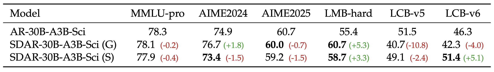

<p align="center">
  
</p>

<div align="center">

[](./LICENSE) [](https://jetastra.github.io/SDAR/) [](https://huggingface.co/collections/JetLM/sdar-689b1b6d392a4eeb2664f8ff) 

</div>

We introduce SDAR (Synergy of Diffusion and AutoRegression), a large-scale diffusion language model that unites the complementary strengths of autoregressive and discrete diffusion modeling. By merging the training efficiency of autoregressive methods with the highly parallel decoding ability of diffusion models, SDAR delivers performance competitive with state-of-the-art open-source AR models. It sets a new standard as the most powerful diffusion-based language model to date—particularly excelling as a generalist model with strong specialist capabilities. 

Highlights:
- 🚀 Low-Cost AR-to-BlockDiffusion
- ⚡ 2-4× Faster Inference 
- 🧠 Advanced performance on science reasoning bechmarks (e.g., GPQA, ChemBench and ranking Top 1 in Physics)

**SDAR is still an early experimental state, we are actively developing more systematic and warmly welcome collaborations in this direction.**

## 🔥 News

- [2025-08-15] We’ve released the inference code for SDAR models, including a built-in script and a third-party inference engine [JetEngine](https://github.com/Labman42/JetEngine) 🚀.
- [2025-07-20] We’ve open-sourced the weights for our [1.7B](https://huggingface.co/JetLM/SDAR-1.7B-Chat), [4B](https://huggingface.co/JetLM/SDAR-4B-Chat), [8B](https://huggingface.co/JetLM/SDAR-8B-Chat) dense models, along with our [30B](https://huggingface.co/JetLM/SDAR-30B-A3B-Chat) MoE model — now available on Hugging Face 🤗.

## 📑 Contents
- [SDAR: A Synergistic Diffusion–AutoRegression Paradigm for Scalable Sequence Generation](https://github.com/JetAstra/SDAR)
  - [🔥 News](#-news)
  - [⚙️ Usage](#-usage)
    - [Environment Setup](#environment-setup)
    - [Training](#training)
    - [Inference](#inference)
  - [📊 Preliminary Experiments](#-preliminary-experiments)
    - [Part I: Scaling the Qwen3 Series with SDAR for General (Non-Reasoning) Tasks](#part-i-scaling-the-qwen3-series-with-sdar-for-general-non-reasoning-tasks)
    - [Part II: Applying SDAR to Qwen3-30B-MoE for Reasoning Benchmarks](#part-ii-applying-sdar-to-qwen3-30b-moe-for-reasoning-benchmarks)
  - [🗂️ Model Zoo](#-model-zoo)
  - [🚩 Roadmap](#-roadmap)
  - [👏 Acknowledge](#-acknowledge)
  - [🤝 Core Contributors](#-core-contributors)
  - [📬 Contact](#-contact)
  - [🔬 Citation](#-citation)
  - [⭐️ Star History](#-star-history)

## ⚙️ Usage

### Environment Setup

```
transformers>=4.52.4
```

### Training

The training code will be released soon.

### Inference

#### 1. Using the built-in inference script

```bash
python generate.py \
  --model_dir=JetLM/SDAR-1.7B-Chat \
  --trust_remote_code
```

#### 2. Using the third-party inference engine [JetEngine](https://github.com/Labman42/JetEngine)

JetEngine, a lightweight inference engine for the SDAR series built on [nano-vllm](https://github.com/GeeeekExplorer/nano-vllm), enables more efficient inference compared to the built-in implementation.

```bash
git clone https://github.com/JetAstra/SDAR.git
cd SDAR
git submodule update --init --recursive
cd third_party/JetEngine
pip install .
```

The following example shows how to quickly load a model with JetEngine and run a prompt end-to-end.

```python
import os
from jetengine import LLM, SamplingParams
from transformers import AutoTokenizer

model_path = os.path.expanduser("/path/to/your/model")
tokenizer = AutoTokenizer.from_pretrained(model_path, trust_remote_code=True)
# Initialize the LLM
llm = LLM(
    model_path,
    enforce_eager=True,
    tensor_parallel_size=1,
    mask_token_id=151669,   # Optional: only needed for masked/diffusion models
    block_length=4
)

# Set sampling/generation parameters
sampling_params = SamplingParams(
    temperature=1.0,
    topk=0,
    topp=1.0,
    max_tokens=256,
    remasking_strategy="low_confidence_dynamic",
    block_length=4,
    denoising_steps=4,
    dynamic_threshold=0.9
)

# Prepare a simple chat-style prompt
prompt = tokenizer.apply_chat_template(
    [{"role": "user", "content": "Explain what reinforcement learning is in simple terms."}],
    tokenize=False,
    add_generation_prompt=True
)

# Generate text
outputs = llm.generate_streaming([prompt], sampling_params)
```


## 📊 Preliminary Experiments
### Part I: Scaling the Qwen3 Series with SDAR for General (Non-Reasoning) Tasks
#### Training Setup

We start from **Qwen3-1.7B-Base**, **Qwen3-4B-Base**, **Qwen3-8B-Base**, and **Qwen3-30B-A3B-Base**.  
Each model is continued-pretrained on **50B tokens (~0.14%)** of relatively low-quality open-source data, followed by supervised fine-tuning (4B tokens).

- **SDAR training**: SDAR-1.7B-Chat / SDAR-4B-Chat / SDAR-8B-Chat / SDAR-30B-A3B-Chat.
- **AR training**: Qwen3-1.7B-AR-SFT / Qwen3-30B-AR-SFT.

#### Evaluation Setup

- **Decoding**  
  - SDAR family: greedy decoding with `block_length = 4`, `denoising_steps = 4`.
  - AR baselines: greedy decoding.
- **Base model sources**  
  - Qwen3-1.7B-Base / Qwen3-30B-Base are taken from the [Qwen3 Technical Report](https://arxiv.org/abs/2505.09388).

#### Experiments of Performance

*Table 1. Overall performance across general benchmarks.*


> [!NOTE]
> - **SDAR-1.7B-Chat** is on par with **Qwen3-1.7B-AR-SFT** across most benchmarks.  
> - **SDAR-30B-A3B-Chat** performs comparably to **Qwen3-30B-AR-SFT**.

#### Experiments of Efficiency

We compare **SDAR-30B-A3B-Chat** and **Qwen3-30B-AR-SFT** under **static** and **dynamic** decoding:

- **Static**: each decoding step emits a fixed number of tokens, independent of confidence.
- **Dynamic**: within a block, once the confidence exceeds a threshold $\theta$, the decoder generate multiple tokens at once (up to the block size).


*Figure 1. Accuracy–speedup under static vs. dynamic inference; dynamic threshold sweeps relative to static.*

> [!NOTE]
> - **SDAR** delivers **>2× speedup** over static inference **with negligible accuracy loss**; its **static speed** is comparable to AR models.  
> - The **speedup scales with model size**, making SDAR increasingly favorable for larger models.

### Part II: Applying SDAR to Qwen3-30B-MoE for Reasoning Benchmarks
#### Training Setup

We start from **Qwen3-30B-A3B-Base** and derive two science-oriented bases via large-scale pretraining and annealing, followed by reasoning SFT:

1) 500B tokens (continual pretraining) + 500B tokens (annealing) → **AR-30B-A3B-Sci-Base**  
2) From the annealing corpus, sample **50B tokens** and continue training with **SDAR** → **SDAR-30B-A3B-Sci-Base**  
3) Fine-tune both bases on reasoning datasets → **AR-30B-A3B-Sci** and **SDAR-30B-A3B-Sci**

#### Evaluation Setup

- **Decoding & inference.**  
  - **AR**: sampling decoding with `temperature=0.6`, `top_p=0.95`, `top_k=20`.  
  - **SDAR**: `block_length=4`, `denoising_steps=4`; we report both **(G)** *greedy* and **(S)** *sampling* (`temperature=1.0`, `top_p=1.0`, `top_k=0`) decoding strategies.
- **Reporting protocol.**  
  Averages over 8 runs for GPQA and 32 runs for AIME 202, AIME 2025, and LMB-hard.  
  Abbreviations: LMB = *LiveMathBench*, LCB = *LiveCodeBench*, **(S)** = *sampling*, **(G)** = *greedy*.

#### Experiments of Performance
##### 1. Strict Experimental Comparison

*Table 2. Strict comparison under identical backbones and datasets.*



> [!NOTE]
> **SDAR-30B-A3B-Sci** consistently outperforms **AR-30B-A3B-Sci**, with pronounced gains on science-focused tasks such as **GPQA**, **ChemBench**, and **PHYSICS**.

##### 2. Comparison to External Open/Closed Models

We position **SDAR-30B-A3B-Sci** against leading open- and closed-source LLMs. External scores are taken from [InternLM/Intern-S1](https://github.com/InternLM/Intern-S1).

*Table 3. Positioning against external models (sources: InternLM/Intern-S1).*


## 🗂️ Model Zoo

| Model                 | Type               | Link                                                                 |
|------------------------|--------------------|----------------------------------------------------------------------|
| SDAR-1.7B-Chat         | Chat               | [huggingface.co/JetLM/SDAR-1.7B-Chat](https://huggingface.co/JetLM/SDAR-1.7B-Chat) |
| SDAR-4B-Chat           | Chat               | [huggingface.co/JetLM/SDAR-4B-Chat](https://huggingface.co/JetLM/SDAR-4B-Chat)     |
| SDAR-8B-Chat           | Chat               | [huggingface.co/JetLM/SDAR-8B-Chat](https://huggingface.co/JetLM/SDAR-8B-Chat)     |
| SDAR-30B-A3B-Chat      | Chat               | [huggingface.co/JetLM/SDAR-30B-A3B-Chat](https://huggingface.co/JetLM/SDAR-30B-A3B-Chat) |
| SDAR-30B-A3B-Sci       | Thinking (Science) | [huggingface.co/JetLM/SDAR-30B-A3B-Sci](https://huggingface.co/JetLM/SDAR-30B-A3B-Sci) |

## 🚩 Roadmap

- [ ] Release SDAR Technical Report
- [ ] Release Inference Engine and Training Framework
- [ ] More Features are working in progress

## 👏 Acknowledge

We would like to express our gratitude to the following works （[MDLM](https://arxiv.org/pdf/2406.07524), [LLaDA](https://arxiv.org/abs/2502.09992), [DiffuLLaMA](https://arxiv.org/abs/2410.17891), [Block Diffusion](https://arxiv.org/abs/2503.09573)） for providing important theoretical foundations and inspiration for SDAR.

## 🤝 Core Contributors

- **Shuang Cheng**: Initial idea proposal, model evaluation, and inference.
- **Dawei Liu**: Implementation of model training code, training experiments.
- **Yihan Bian**: Engineering optimization, inference & training acceleration, MOE training code implementation.
- **Biqing Qi**: Project Leader and overall coordination.

> [!NOTE]
> *Note: This project is a collaborative effort, with all contributors solving challenges together.*

For the full list of contributors, please refer to the author list in the citation. We are also deeply grateful to everyone who engaged in discussions and provided valuable feedback throughout the development of this project.

## 📬 Contact

For issues or inquiries:

- **Shuang Cheng**, Shanghai AI Lab (chengshuang@pjlab.org.cn)
- **Biqing Qi** (Corrsponding Author), Shanghai AI Lab (qibiqing@pjlab.org.cn)

## 🔬 Citation

```
@misc{JetAstra2025,
  title={SDAR: A Synergistic Diffusion–AutoRegression Paradigm for Scalable Sequence Generation},
  author={Shuang Cheng and Yihan Bian and Dawei Liu and Yuhua Jiang and Yihao Liu and Linfeng Zhang and Wenghai Wang and Qipeng Guo and Kai Chen and Biqing Qi* and Bowen Zhou},
  year={2025},
  institution={Shanghai AI Lab},
  url={https://github.com/JetAstra/SDAR}
}
```

## ⭐️ Star History

[](https://www.star-history.com/#JetAstra/SDAR&Date)
