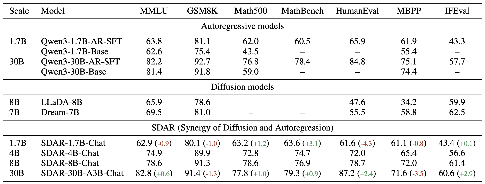
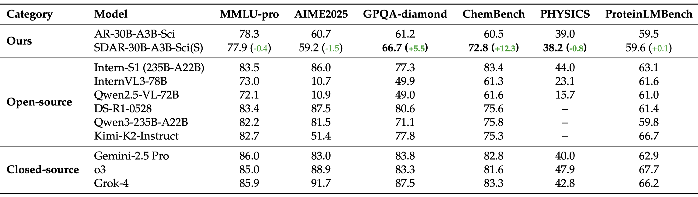

<p align="center">
  
</p>

<div align="center">

[](./LICENSE) [](https://jetastra.github.io/SDAR/) [](https://huggingface.co/collections/JetLM/sdar-689b1b6d392a4eeb2664f8ff) 

</div>

**SDAR** (**S**ynergy of **D**iffusion and **A**uto**R**egression) model is a new large language model that integrates autoregressive (AR) and discrete diffusion modeling strategies. It combines the efficient training paradigm of AR models with the highly parallel inference capability of diffusion models, while delivering performance fully on par with SOTA open-source AR models. At the same time, SDAR sets a new benchmark as the most powerful diffusion language model to date.

Key Features:
- 🚀 Low-Cost AR-to-BlockDiffusion
- ⚡ 2-4× Faster Inference 
- 🧠 Advanced performance on science reasoning bechmarks (e.g., GPQA, ChemBench, Physics (Top1) ) 

**SDAR is still a early experimental State, we are actively developing more systematic and warmly welcome collobrations in this drection.**


## 🔥 News
- [2025-08-15] We’ve released the inference code for SDAR models, including a built-in script and a third-party inference engine [JetEngine](https://github.com/Labman42/JetEngine) 🚀.
- [2025-07-20] We’ve open-sourced the weights for our [1.7B](https://huggingface.co/JetLM/SDAR-1.7B-Chat), [4B](https://huggingface.co/JetLM/SDAR-4B-Chat), [8B](https://huggingface.co/JetLM/SDAR-8B-Chat) dense models, along with our [30B](https://huggingface.co/JetLM/SDAR-30B-A3B-Chat) MoE model — now available on Hugging Face 🤗.


## 📑 Content
- [SDAR: A Synergistic Diffusion–AutoRegression Paradigm for Scalable Sequence Generation](https://github.com/JetAstra/SDAR)
  - [🗞️ News](#️-news)
  - [🛣️ Upcoming](#️-upcoming)
  - [🗂️ Model Zoo](#️-model-zoo)
  - [⚙️ Usage](#️-usage)
    - [Environment Setup](#environment-setup)
    - [Training](#training)
    - [Inference](#inference)
  - [📊 Benchmarks](#-benchmarks)
    - [Scaling the Qwen3 Series](#scaling-the-qwen3-series-with-sdar-for-general-non-reasoning-tasks)
    - [Applying SDAR to Qwen3-30B-MoE](#applying-sdar-to-qwen3-30b-moe-for-reasoning-benchmarks)
  - [🔥 Highlight](#-highlight)
  - [🚩 Roadmap](#-roadmap)
  - [👏 Acknowledge](#-acknowledge)
  - [🤝 Core Contributors](#-core-contributors)
  - [📬 Contact](#-contact)
  - [🔬 Citation](#-citation)
  - [⭐️ Star History](#️-star-history)

## ⚙️ Usage

### Environment Setup

```
transformers>=4.52.4
```

### Training

The training code will be released soon.

### Inference

#### 1. Using the built-in inference script

```bash
python generate.py \
  --model_dir=JetLM/SDAR-1.7B-Chat \
  --trust_remote_code
```

#### 2. Using the third-party inference engine [JetEngine](https://github.com/Labman42/JetEngine)

JetEngine, a lightweight inference engine for the SDAR series built on [nano-vllm](https://github.com/GeeeekExplorer/nano-vllm), enables more efficient inference compared to the built-in implementation.

```bash
git clone https://github.com/JetAstra/SDAR.git
cd SDAR
git submodule update --init --recursive
cd third_party/JetEngine
pip install .
```

The following example shows how to quickly load a model with JetEngine and run a prompt end-to-end.

```python
import os
from jetengine import LLM, SamplingParams
from transformers import AutoTokenizer

model_path = os.path.expanduser("/path/to/your/model")
tokenizer = AutoTokenizer.from_pretrained(model_path, trust_remote_code=True)
# Initialize the LLM
llm = LLM(
    model_path,
    enforce_eager=True,
    tensor_parallel_size=1,
    mask_token_id=151669,   # Optional: only needed for masked/diffusion models
    block_length=4
)

# Set sampling/generation parameters
sampling_params = SamplingParams(
    temperature=1.0,
    topk=0,
    topp=1.0,
    max_tokens=256,
    remasking_strategy="low_confidence_dynamic",
    block_length=4,
    denoising_steps=4,
    dynamic_threshold=0.9
)

# Prepare a simple chat-style prompt
prompt = tokenizer.apply_chat_template(
    [{"role": "user", "content": "Explain what reinforcement learning is in simple terms."}],
    tokenize=False,
    add_generation_prompt=True
)

# Generate text
outputs = llm.generate_streaming([prompt], sampling_params)
```


## 📊 Preliminary Experiments

<!-- ### PartI: Scaling the Qwen3 Series with SDAR for General (Non-Reasoning) Tasks
#### Training Settings

We use Qwen3-1.7B-Base, Qwen3-4B-Base, Qwen3-8B-Base, and Qwen3-30B-A3B-Base as base models. Each model undergoes continued pretraining on 0.14% (50B) tokens of relatively low quality data (opensource data), followed by fine-tuning on the general SFT dataset.

- SDAR-1.7B-Chat, SDAR-4B-Chat, SDAR-8B-Chat, and SDAR-30B-A3B-Chat are trained using the **SDAR training scheme**.
- Qwen3-1.7B-AR-SFT and Qwen3-30B-AR-SFT are trained using the **autoregressive (AR) training scheme**.

#### Experiemnt of Performance

For **SDAR** models, inference hyperparameters are set to: `block_length = 4`, `denoising_steps = 4`, greedy decoding.

For **Qwen3-1.7B-AR-SFT** and **Qwen3-30B-AR-SFT**, we use *greedy decoding*, and the base models **Qwen3-1.7B-Base** and **Qwen3-30B-Base** are derived from the [Qwen3 Technical Report](https://arxiv.org/abs/2505.09388).

<p align="center">
  
<p align="center">

> [!NOTE]
> - SDAR-1.7B-Chat achieves comparable performance to Qwen3-1.7B-AR-SFT across most benchmarks.
> - SDAR-30B-A3B-Chat performs on par with Qwen3-30B-AR-SFT on the evaluated benchmarks.

#### Experiemnt of Efficiency

We compare the performance of **SDAR-30B-A3B-Chat** and **Qwen3-30B-AR-SFT** under both *dynamic* and *static* inference settings.
Additionally, we evaluate how varying the threshold in dynamic inference affects speed relative to static inference.

<p align="center">
  
</p>

> [!NOTE]
> - SDAR achieves **over 2× faster inference speed** compared to static inference almost **without any loss in accuracy**, with its static inference speed being comparable to that of AR models.
> - The speedup effect tends to become more pronounced with increasing model size. -->
### Part I: Scaling the Qwen3 Series with SDAR for General (Non-Reasoning) Tasks

#### Training Setup
We start from **Qwen3-1.7B-Base**, **Qwen3-4B-Base**, **Qwen3-8B-Base**, and **Qwen3-30B-A3B-Base**.  
Each model is continued-pretrained on **50B tokens (~0.14%)** of relatively low-quality open-source data, followed by supervised fine-tuning (4B tokens).

- **SDAR training**: SDAR-1.7B-Chat / SDAR-4B-Chat / SDAR-8B-Chat / SDAR-30B-A3B-Chat.
- **AR training**: Qwen3-1.7B-AR-SFT / Qwen3-30B-AR-SFT.

#### Evaluation Setup
- **Decoding**  
  - SDAR family: greedy decoding with `block_length = 4`, `denoising_steps = 4`..  
  - AR baselines: greedy decoding.
- **Base model sources**  
  Qwen3-1.7B-Base / Qwen3-30B-Base are taken from the [Qwen3 Technical Report](https://arxiv.org/abs/2505.09388).

#### Performance

*Figure 1. Overall performance across general benchmarks.*

> [!NOTE]
> - **SDAR-1.7B-Chat** is on par with **Qwen3-1.7B-AR-SFT** across most benchmarks.  
> - **SDAR-30B-A3B-Chat** performs comparably to **Qwen3-30B-AR-SFT**.

#### Efficiency
We compare **SDAR-30B-A3B-Chat** and **Qwen3-30B-AR-SFT** under **static** and **dynamic** inference:
- **Static**: fixed block schedule.
- **Dynamic**: block schedule adapts to a confidence threshold; higher thresholds favor speed while preserving accuracy until a knee point.


*Figure 2. Accuracy–speedup under static vs. dynamic inference; dynamic threshold sweeps relative to static.*

> [!NOTE]
> - **SDAR** delivers **>2× speedup** over static inference **with negligible accuracy loss**; its **static speed** is comparable to AR models.  
> - The **speedup scales with model size**, making SDAR increasingly favorable for larger models.


### PartII: Applying SDAR to Qwen3-30B-MoE for Reasoning Benchmarks
#### Training Settings

Starting from **Qwen3-30B-A3B-Base**, we trained on 500B tokens (including scientific data) using the NTP strategy, followed by 500B tokens of annealing, resulting in the **AR-30B-A3B-Sci-Base** model. Based on AR-30B-A3B-Sci-Base, we then performed continued training with the SDAR strategy using 50B tokens randomly sampled from the 500B annealing dataset, producing the **SDAR-30B-A3B-Sci-Base** model. Finally, both AR-30B-A3B-Sci-Base and SDAR-30B-A3B-Sci-Base were further fine-tuned on reasoning datasets to obtain the **AR-30B-A3B-Sci** and **SDAR-30B-A3B-Sci** models, respectively.


#### Experiemnt of Performance

For the **AR-30B-A3B-Sci** model, we use decoding parameters `temperature=0.6`, `top_p=0.95`, and `top_k=20`.
For the **SDAR-30B-A3B-Sci** model, we set `block_length=4` and `denoising_steps=4`, and perform decoding with both greedy and sampling strategies, where the sampling parameters are `temperature=1.0`, `top_p=1.0`, and `top_k=0`. 

##### 1. Strict Experimental Comparison

This table presents a **controlled comparison** between AR and SDAR under the same backbone and dataset settings.
The results are averaged over 8 runs for GPQA, and over 32 runs each for AIME 2024, AIME 2025, and LMB-hard.
Note: LMB denotes LiveMathBench, LCB denotes LiveCodeBench; (S) indicates sampling decoding, and (G) indicates greedy decoding.

<p align="center">
  
<p align="center">

> [!NOTE]
> - 📈 **Strict experimental comparison (AR vs. SDAR):** Under identical settings, **SDAR-30B-A3B-Sci** consistently outperforms **AR-30B-A3B-Sci**, with especially notable gains on science-focused tasks such as **GPQA**, **ChemBench**, and **PHYSICS**.

##### 2. Comparison with Other Open/Closed Models

This table positions **SDAR-30B-A3B-Sci(sample)** against leading open-source and closed-source LLMs.
Scores for external models are sourced from the [InternLM/Intern-S1](https://github.com/InternLM/Intern-S1) repository.

<p align="center">
  
<p align="center">

## 🗂️ Model Zoo

| Model                 | Type               | Link                                                                 |
|------------------------|--------------------|----------------------------------------------------------------------|
| SDAR-1.7B-Chat         | Chat               | [huggingface.co/JetLM/SDAR-1.7B-Chat](https://huggingface.co/JetLM/SDAR-1.7B-Chat) |
| SDAR-4B-Chat           | Chat               | [huggingface.co/JetLM/SDAR-4B-Chat](https://huggingface.co/JetLM/SDAR-4B-Chat)     |
| SDAR-8B-Chat           | Chat               | [huggingface.co/JetLM/SDAR-8B-Chat](https://huggingface.co/JetLM/SDAR-8B-Chat)     |
| SDAR-30B-A3B-Chat      | Chat               | [huggingface.co/JetLM/SDAR-30B-A3B-Chat](https://huggingface.co/JetLM/SDAR-30B-A3B-Chat) |
| SDAR-30B-A3B-Sci       | Thinking (Science)| [huggingface.co/JetLM/SDAR-30B-A3B-Sci](https://huggingface.co/JetLM/SDAR-30B-A3B-Sci) |


## 🚩 Roadmap

- [ ] Release STAR Technical Report
- [ ] Release Inference Engine and Training Framework
- [ ] More Features are working in Progess


## 👏 Acknowledge
We would like to express our gratitude to the following works （[MDLM](https://arxiv.org/pdf/2406.07524), [LLaDA](https://arxiv.org/abs/2502.09992), [DiffuLLaMA](https://arxiv.org/abs/2410.17891), [Block Diffusion](https://arxiv.org/abs/2503.09573)） for providing important theoretical foundations and inspiration for SDAR.

## 🤝 Core Contributors

- **Shang Cheng**: Initial idea proposal, model evaluation, and inference.
- **Dawei Liu**: Implementation of model training code, training experiments.
- **Yihan Bian**: Engineering optimization, inference & training acceleration, MOE training code implementation.
- **Biqing Qi**: Project Leader and overall coordination.

> [!NOTE]
> *Note: This project is a collaborative effort, with all contributors solving challenges together.*

For the full list of contributors, please refer to the author list in the citation. We are also deeply grateful to everyone who engaged in discussions and provided valuable feedback throughout the development of this project.

## 📬 Contact

For issues or inquiries:

- **Shang Cheng**, Shanghai AI Lab (chengshuang@pjlab.org.cn)
- **Biqing Qi (Corrsponding Author)**, Shanghai AI Lab (qibiqing@pjlab.org.cn)

## 🔬 Citation

```
@misc{JetAstra2025,
  title={SDAR: A Synergistic Diffusion–AutoRegression Paradigm for Scalable Sequence Generation},
  author={Shuang Cheng and Yihan Bian and Dawei Liu and Yuhua Jiang and Yihao Liu and Lingfeng Zhang, Wenghai Wang, Qipeng Guo and Kai Chen and Biqing Qi* and Bowen Zhou*},
  year={2025},
  institution={Shanghai AI Lab},
  url={https://github.com/JetAstra/SDAR}
}
```
## ⭐️ Star History

[](https://www.star-history.com/#JetAstra/SDAR&Date)
