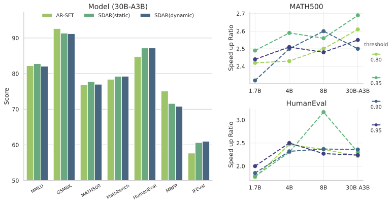

<p align="center">
  
</p>


**SDAR**(**S**ynergy of **D**iffusion and **A**uto**R**egression)-model is a new large language model that integrates autoregressive (AR) and discrete diffusion modeling strategies. It combines the efficient training paradigm of AR models with the highly parallel inference capability of diffusion models, while delivering performance fully on par with SOTA opensource AR models. At the same time, SDAR sets a new benchmark as the most powerful diffusion language model to date.

## 🗞️ News
 [2025-07-20] — We’ve open-sourced the weights for our [1.7B](https://huggingface.co/JetLM/SDAR-1.7B-Chat), [4B](https://huggingface.co/JetLM/SDAR-4B-Chat), [8B](https://huggingface.co/JetLM/SDAR-8B-Chat) dense models, along with our [30B](https://huggingface.co/JetLM/SDAR-30B-A3B-Chat) MoE model — now available on Hugging Face 🤗.


## ⚙️ Usage

### Environment Setup

```
transformers>=4.52.4
```

### Training

The training code will be released soon.

### Inference

```sh
python generate.py \
  --model_dir=JetLM/SDAR-1.7B-Chat \
  --trust_remote_code
```

## 📊 Benchmarks

### Settings

We use Qwen3-1.7B-Base, Qwen3-4B-Base, Qwen3-8B-Base, and Qwen3-30B-A3B-Base as base models. Each model undergoes continued pretraining on 0.14% (50B) tokens of relatively low quality data (opensource data), followed by fine-tuning on the general SFT dataset.

- SDAR-1.7B-Chat, SDAR-4B-Chat, SDAR-8B-Chat, and SDAR-30B-A3B-Chat are trained using the **SDAR training scheme**.
- Qwen3-1.7B-AR-SFT and Qwen3-30B-AR-SFT are trained using the **autoregressive (AR) training scheme**.

### Performance

For **SDAR** models, inference hyperparameters are set to: `block_length = 4`, `denoising_steps = 4`, greedy decoding.

For **Qwen3-1.7B-AR-SFT** and **Qwen3-30B-AR-SFT**, we use *greedy decoding*, and the base models **Qwen3-1.7B-Base** and **Qwen3-30B-Base** are derived from the [Qwen3 Technical Report](https://arxiv.org/abs/2505.09388).

<p align="center">

| Model             | MMLU  | GSM8K | Math500 | MathBench | HumanEval | MBPP  | IFEval |
|:------------------|:-----:|:-----:|:-------:|:---------:|:---------:|:-----:|:------:|
| SDAR-1.7B-Chat    | 62.90 | 80.06 | 63.20   | 63.55     | 61.59     | 61.09 | 43.44  |
| SDAR-4B-Chat      | 74.85 | 89.92 | 72.80   | 74.71     | 71.95     | 65.37 | 56.56  |
| SDAR-8B-Chat      | 78.61 | 91.28 | 78.60   | 76.94     | 78.66     | 71.98 | 61.37  |
| SDAR-30B-A3B-Chat | 82.80 | 91.36 | 77.80   | 79.25     | 87.20     | 71.60 | 60.63  |
| Qwen3-1.7B-AR-SFT | 63.82 | 81.12 | 62.00   | 60.53     | 65.85     | 61.87 | 43.25  |
| Qwen3-30B-AR-SFT  | 82.23 | 92.65 | 76.80   | 78.41     | 84.76     | 75.10 | 57.67  |
| Qwen3-1.7B-Base   | 62.60 | 75.44 | 43.50   | –         | –         | 55.40 | –      |
| Qwen3-30B-Base    | 81.38 | 91.81 | 59.04   | –         | –         | 74.40 | –      |

</p>

> **Key observations:**
> SDAR-1.7B-Chat achieves comparable performance to Qwen3-1.7B-AR-SFT across most benchmarks.
> SDAR-30B-A3B-Chat performs on par with Qwen3-30B-AR-SFT on the evaluated benchmarks.

### Efficiency

We compare the performance of **SDAR-30B-A3B-Chat** and **Qwen3-30B-AR-SFT** under both *dynamic* and *static* inference settings.
Additionally, we evaluate how varying the threshold in static inference affects speed relative to dynamic inference.

<p align="center">
  
</p>

> **Key observations:**
> • SDAR achieves **over 2× faster inference speed** compared to static inference almost **without any loss in accuracy**, with its static inference speed being comparable to that of AR models.
> • The speedup effect becomes more pronounced as the model size increases.
> • At present, SDAR does not employ a dedicated inference engine or custom operators; therefore, direct hardware-level speed comparisons with AR models are not provided. These optimizations will be released in the future, enabling more comprehensive hardware-based benchmarks.


## 🔥 Highlight

1. **Innovation** — Alleviates the inefficiency of autoregressive (AR) models during inference while preserving their training efficiency. Additionally, it leverages diffusion mechanisms to reduce causal inductive bias in relevant scenarios.

2. **Efficient Computation** — Integrates the training efficiency of AR models with the fast inference capabilities of diffusion models, achieving up to **2× faster inference**.

3. **Strong Performance** — Demonstrates state-of-the-art results across diverse benchmarks:
   - The **non-reasoning variant** matches or outperforms the strongest existing AR models of the same scale.
   - The **reasoning variant** performs competitively with top-tier **Qwen3** models.
   - Unlike most current diffusion-based LMs—often limited to small-scale experiments or niche tasks (e.g., code generation)—**our models are production-ready and widely applicable**.


## 🚩 Roadmap
- [x] release non-reasoning models
- [x] release naive inference code
- [ ] release inference engine
- [ ] release training code
- [ ] release reasoning models

## 🔬 Citation

```
@misc{JetAstra2025,
  title={SDAR: Synergy of Diffusion and AutoRegression},
  author={Shuang Cheng and Dawei Liu and Yihan Bian},
  year={2025},
  institution={Shanghai AI Lab},
  url={https://github.com/JetAstra/SDAR}
}
```
## ⭐️ Star History

[](https://www.star-history.com/#JetAstra/SDAR&Date)
